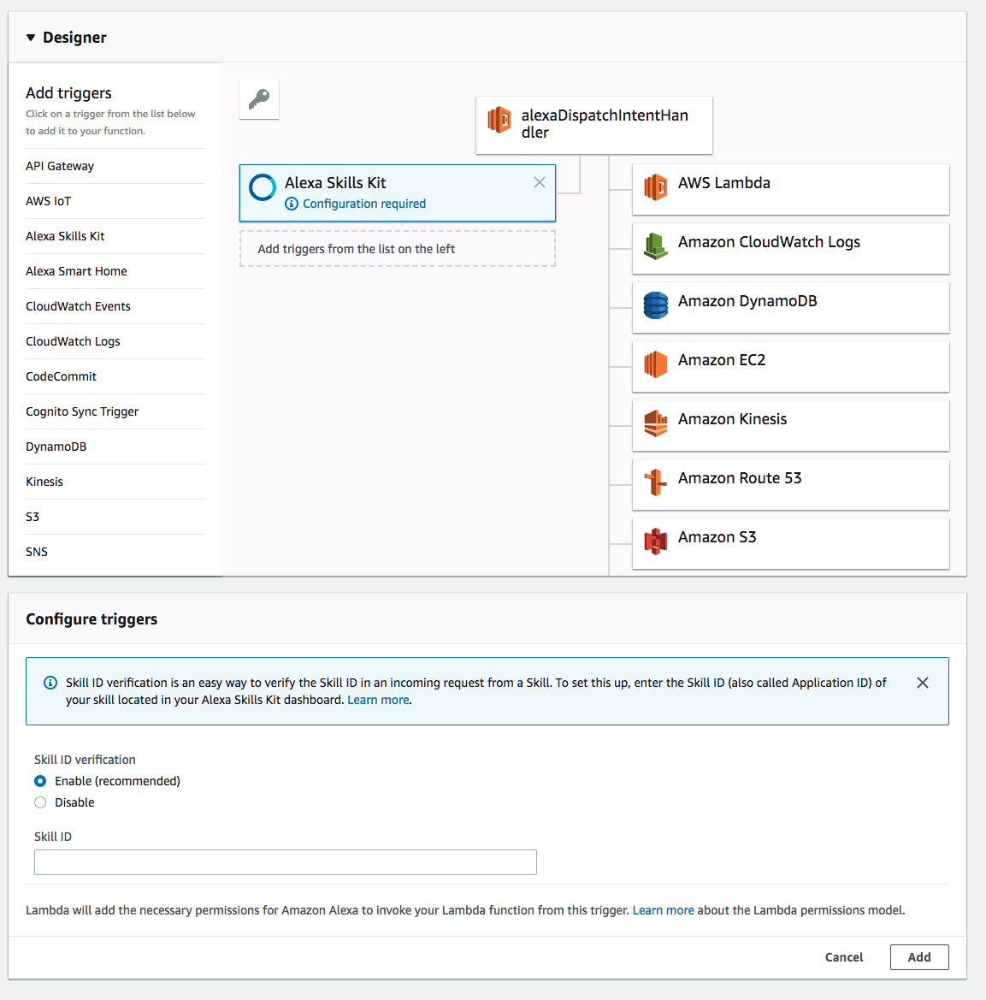

# Build Alexa Skills in Go using AWS Lambda

## How it works

See `example/main.go`

### How to upload your code to AWS using Lambda

Build a binary that runs on Linux and zip it up into a deployment package.

```
$ GOOS=linux go build -o lambda_handler
$ zip deployment.zip main
```

Assuming you have already installed `aws-cli`:

`NOTE:` \
function-name: name which handles the requests (in our example it is alexaDispatchIntentHandler) \ 
handler: name of the binary file (here it is lambda_handler) \
region: in order to run Alexa Skills with AWS Lambda you need to choose eu-west-1, us-east-1 or eu-west-1

```
aws lambda create-function \
  --region eu-west-1 \
  --function-name alexaDispatchIntentHandler \
  --memory 128 \
  --role arn:aws:iam::<account-id>:role/<role> \
  --runtime go1.x \
  --zip-file fileb://deployment.zip \
  --handler lambda_handler
```

Verify if your function was uploaded:


- Open your function you've uploaded
- Add trigger `"Alexa Skills Kit"`

- Add the Alexa Skill ID from Amazon Developer
- Save your changes
